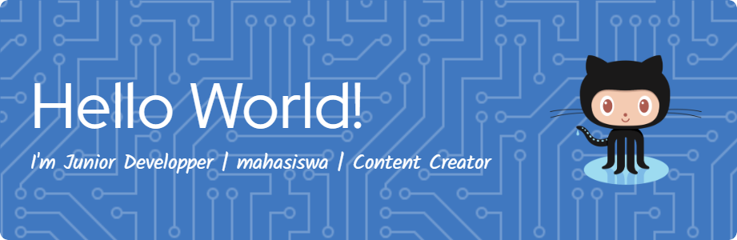

a# Muhammad Farhan Maulana
## Software Developer | Computer Science Student 👨‍💻

  

  
  
  

  

---

🎯 Tentang Saya

Saya seorang pengembang perangkat lunak dan mahasiswa ilmu komputer yang penuh semangat dengan minat besar pada pengembangan web, aplikasi mobile, dan teknologi terbaru. Saat ini saya sedang menempuh pendidikan sambil memperoleh pengalaman praktis dalam berbagai bahasa pemrograman dan framework.

🌟 Apa yang Sedang Saya Kerjakan

🔭 Membangun aplikasi web full-stack menggunakan Laravel dan framework JavaScript modern

🌱 Mempelajari pengembangan mobile tingkat lanjut dengan Flutter dan Kotlin

👯 Ingin berkolaborasi dalam proyek open source

💬 Tanyakan kepada saya tentang pengembangan web, aplikasi mobile, atau teknologi blockchain
## 💼 Professional Skills

### 🚀 Programming Languages

  
  
  
  
  
  
  
  
  
  
  

### 🛠️ Frameworks & Tools

  
  
  
  
  
  
  
  
  
  
  
  
  
  
  
  
  
  
  
  
  
  

### 🗄️ Databases

  
  
  
  

### ☁️ Cloud & DevOps

  
  
  

### 🤖 AI & Productivity Tools

  
  
  
  
  

###🎮 Games 

  
  
  
  

---

## 📊 GitHub Analytics

  
  

  

---

## 🏆 GitHub Trophies

  

---

## 📈 Contribution Activity

  

---

## 🎮 Fun Corner

### 🐍 Contribution Snake

  <picture>
    <source media="(prefers-color-scheme: dark)" srcset="https://raw.githubusercontent.com/Hanz26456/Hanz26456/output/github-contribution-grid-snake-dark.svg">
    <source media="(prefers-color-scheme: light)" srcset="https://raw.githubusercontent.com/Hanz26456/Hanz26456/output/github-contribution-grid-snake.svg">
    
  </picture>

### 📊 3D Contribution Calendar

  

### 🔥 GitHub Streak with Fire Animation

  

### ⚡ Dynamic Profile Summary

  

### 🌟 Animated Typing SVG

  

### 🌊 Wave Animation

  

---

## 📫 Let's Connect!

I'm always interested in connecting with fellow developers and discussing new opportunities. Feel free to reach out!

  
  

---

  

  <i>⭐️ From <a href="https://github.com/Hanz26456">Muhammad Farhan Maulana</a></i>

